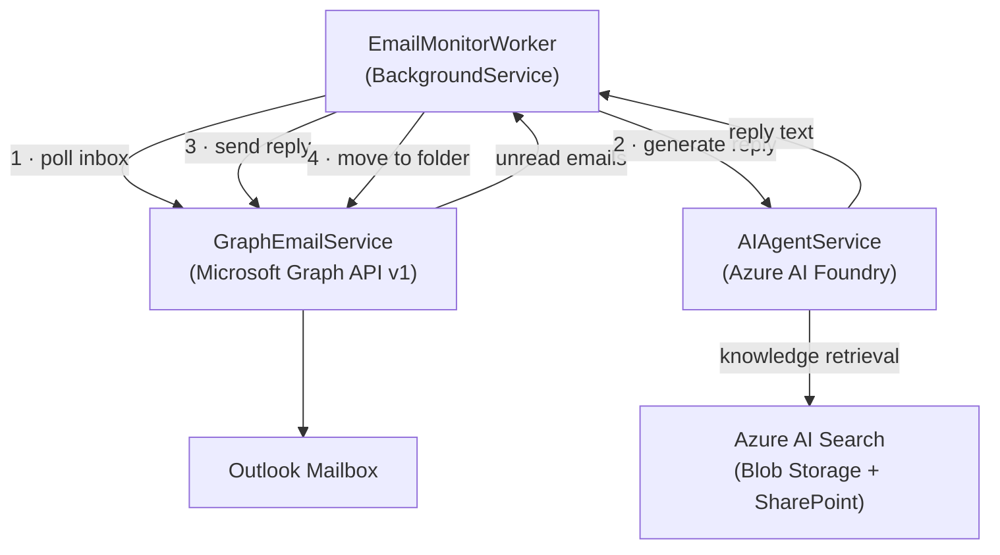

# emailAgent

A .NET 10 Worker Service that monitors an Outlook inbox, uses **Azure AI Foundry** and the **Azure AI Projects Agentic framework** to process incoming emails with knowledge from SharePoint and Azure Blob Storage (via Azure AI Search), sends an AI-generated reply, and moves the processed message to a designated inbox folder.

## Architecture



> **Advanced option:** The codebase also includes a **GraphRAG** pipeline backed by Azure Cosmos DB for Apache Gremlin.
> This feature is **disabled by default** (`GraphRag:Enabled = false`) and requires additional infrastructure.
> See [Graph RAG with Cosmos DB Gremlin](docs/graph-rag-cosmos-gremlin.md) for details on enabling it.

## Prerequisites

| Requirement | Notes |
|---|---|
| .NET 10 SDK | `dotnet --version` should show `10.x` |
| Azure subscription | With an Azure AI Foundry project |
| Azure AD App Registration | Needs **Mail.ReadWrite** + **Mail.Send** Graph API permissions (application permissions, not delegated) |
| Azure AI Foundry project | With a model deployment (e.g. `gpt-4o`) |
| Azure AI Search resource | Connected to the Foundry project; index must cover Blob/SharePoint content |
| Azure Cosmos DB for Apache Gremlin | With a database and graph container for GraphRAG (optional – can be disabled) |
| Outlook mailbox | A folder named **Processed** (or whatever you configure) must already exist |

## Configuration

All settings live in `appsettings.json` (or user secrets / environment variables for local development).

### Microsoft Graph (`Graph`)

```json
"Graph": {
  "TenantId": "<azure-ad-tenant-id>",
  "ClientId": "<app-registration-client-id>",
  "ClientSecret": "<app-registration-client-secret>",
  "UserEmail": "support@contoso.com"
}
```

The application uses **app-only** auth (`ClientSecretCredential`). Grant the app registration:

- `Mail.ReadWrite` (Application)
- `Mail.Send` (Application)

### Azure AI Foundry (`AIFoundry`)

```json
"AIFoundry": {
  "ProjectEndpoint": "https://<region>.api.azureml.ms/",
  "ModelDeploymentName": "gpt-4o",
  "AISearchConnectionId": "<foundry-connection-id-for-azure-ai-search>",
  "AISearchIndexName": "<search-index-name>",
  "SharePointConnectionId": "<foundry-connection-id-for-sharepoint>",
  "AgentName": "email-agent"
}
```

- **ProjectEndpoint** – copy from the Azure AI Foundry portal → Project overview → "Project endpoint".
- **ModelDeploymentName** – name shown in "Models + endpoints" tab.
- **AISearchConnectionId** – the Foundry connection ID for your Azure AI Search resource (found under "Management → Connections").
- **AISearchIndexName** – the name of the search index that contains documents from Azure Blob Storage and/or SharePoint.
- **SharePointConnectionId** – optional; leave blank to skip the SharePoint grounding tool.
- **AgentName** – the internal name used to register the agent in Foundry Agent Administration.

> **Authentication to Foundry** is handled automatically by `DefaultAzureCredential`.  
> Assign the managed identity (or your local developer account) the **Azure AI Developer** role on the Foundry project.

### Email processing (`EmailProcessing`)

```json
"EmailProcessing": {
  "PollingIntervalSeconds": 30,
  "ProcessedFolderName": "Processed"
}
```

### GraphRAG (`GraphRag`) – advanced, disabled by default

GraphRAG enriches AI replies with customer relationship context from a knowledge graph.  It is **disabled by default** in this sample.  To enable it, set `Enabled` to `true` and provide the Cosmos DB Gremlin connection details.  See [Graph RAG with Cosmos DB Gremlin](docs/graph-rag-cosmos-gremlin.md) for the full guide.

```json
"GraphRag": {
  "GremlinEndpoint": "wss://<account>.gremlin.cosmos.azure.com:443/",
  "DatabaseName": "emailAgentDb",
  "GraphName": "knowledgeGraph",
  "AccountKey": "",
  "PartitionKey": "email-agent",
  "MaxRelatedIssues": 3,
  "Enabled": false
}
```

Set `GraphRag:AccountKey` via user secrets or environment variables.

## Running locally

```bash
# Clone and restore
git clone https://github.com/dbruun/emailAgent.git
cd emailAgent/src/EmailAgent

# Populate secrets (instead of editing appsettings.json directly)
dotnet user-secrets set "Graph:TenantId"           "<tenant-id>"
dotnet user-secrets set "Graph:ClientId"           "<client-id>"
dotnet user-secrets set "Graph:ClientSecret"       "<client-secret>"
dotnet user-secrets set "Graph:UserEmail"          "support@contoso.com"
dotnet user-secrets set "AIFoundry:ProjectEndpoint"      "https://..."
dotnet user-secrets set "AIFoundry:ModelDeploymentName"  "gpt-4o"
dotnet user-secrets set "AIFoundry:AISearchConnectionId" "<conn-id>"
dotnet user-secrets set "AIFoundry:AISearchIndexName"    "<index>"
# Optional SharePoint:
dotnet user-secrets set "AIFoundry:SharePointConnectionId" "<conn-id>"

# Run
dotnet run
```

## Running in production (Azure Container Apps / AKS)

Build the Docker image:

```bash
dotnet publish -c Release -o publish
docker build -t email-agent .
```

Deploy as a long-running container. Use a **managed identity** instead of a client secret; remove the `Graph:ClientSecret` setting and update `GraphEmailService` to use `ManagedIdentityCredential` (or keep `DefaultAzureCredential` which will pick up the managed identity automatically). Assign the managed identity:

- **Azure AI Developer** role on the Foundry project.
- **Exchange Online** app permissions via the tenant admin.

## Project structure

```
src/EmailAgent/
├── Configuration/
│   ├── AIFoundrySettings.cs          # Azure AI Foundry settings
│   ├── EmailProcessingSettings.cs    # Polling interval & folder name
│   ├── GraphRagSettings.cs           # Cosmos DB Gremlin / GraphRAG settings
│   └── GraphSettings.cs              # Microsoft Graph / Entra ID settings
├── Models/
│   ├── EmailItem.cs                  # Immutable email snapshot
│   └── GraphContext.cs               # Graph context & prior-issue records
├── Services/
│   ├── IAIAgentService.cs            # AI agent abstraction
│   ├── AIAgentService.cs             # Azure AI Foundry implementation
│   ├── IGraphEmailService.cs         # Graph email abstraction
│   ├── GraphEmailService.cs          # Microsoft Graph SDK v5 implementation
│   ├── IGraphRagService.cs           # GraphRAG abstraction + ExtractedEntities
│   └── GraphRagService.cs            # Cosmos DB Gremlin implementation
├── Workers/
│   └── EmailMonitorWorker.cs         # BackgroundService – orchestrates poll loop
├── Program.cs                        # DI registration & host setup
└── appsettings.json                  # Configuration template

tests/EmailAgent.Tests/
├── ModelAndConfigTests.cs            # Record & settings default tests
├── Services/
│   ├── AIAgentServiceTests.cs        # BuildGraphContextBlock tests
│   └── GraphRagServiceTests.cs       # Disabled paths, helpers, fallback extraction
└── Workers/
    └── EmailMonitorWorkerTests.cs    # Full worker loop tests with mocks
```

## Further Reading

| Document | Description |
|---|---|
| [Graph RAG with Cosmos DB Gremlin](docs/graph-rag-cosmos-gremlin.md) | Advanced optional feature – architecture, data model, and infrastructure setup for enabling GraphRAG via Azure Cosmos DB for Apache Gremlin |

## Key packages

| Package | Purpose |
|---|---|
| `Azure.AI.Projects` v2 | Azure AI Foundry SDK – `AIProjectClient`, `AgentAdministrationClient`, `ProjectResponsesClient` |
| `Azure.Identity` | `DefaultAzureCredential` / `ClientSecretCredential` |
| `Gremlin.Net` | Apache TinkerPop .NET driver used for Cosmos DB Gremlin GraphRAG operations |
| `Microsoft.Graph` v5 | Microsoft Graph SDK for Outlook / Exchange operations |
| `Microsoft.Extensions.Hosting` | Worker Service host and `BackgroundService` base class |
