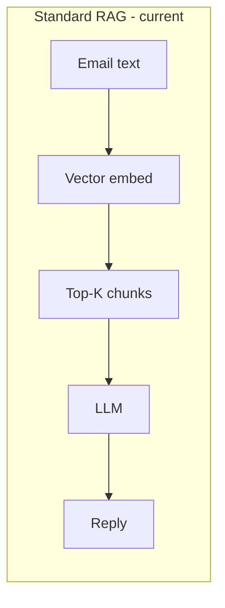
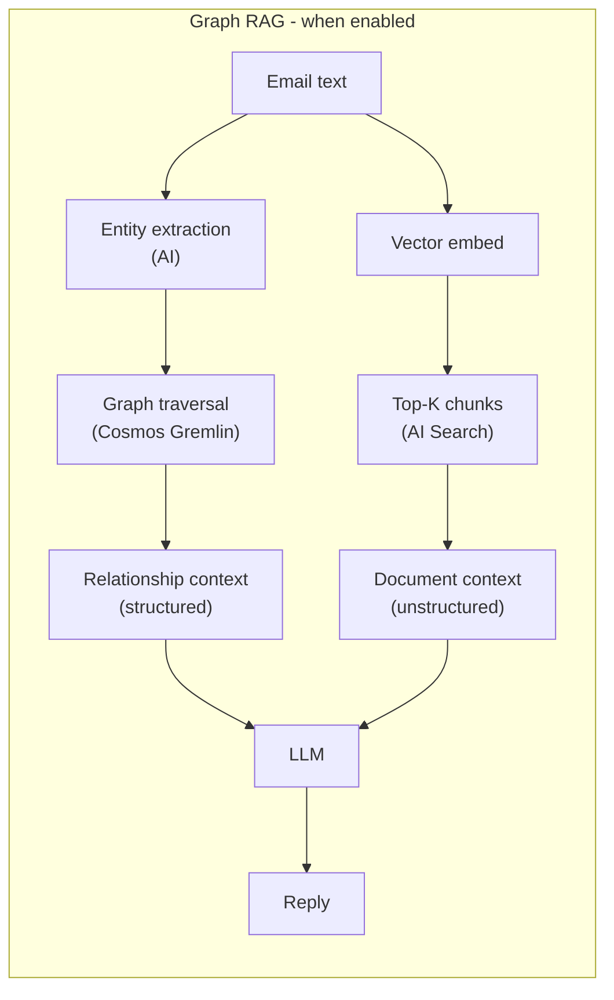
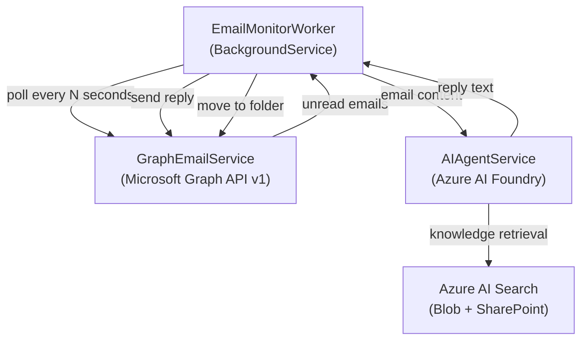
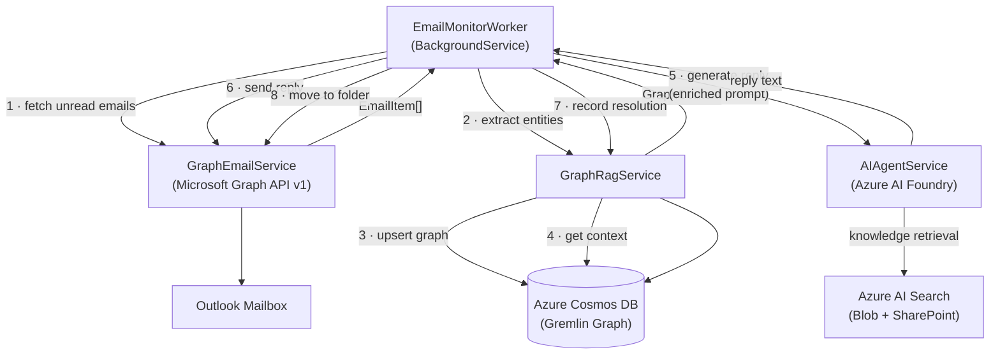
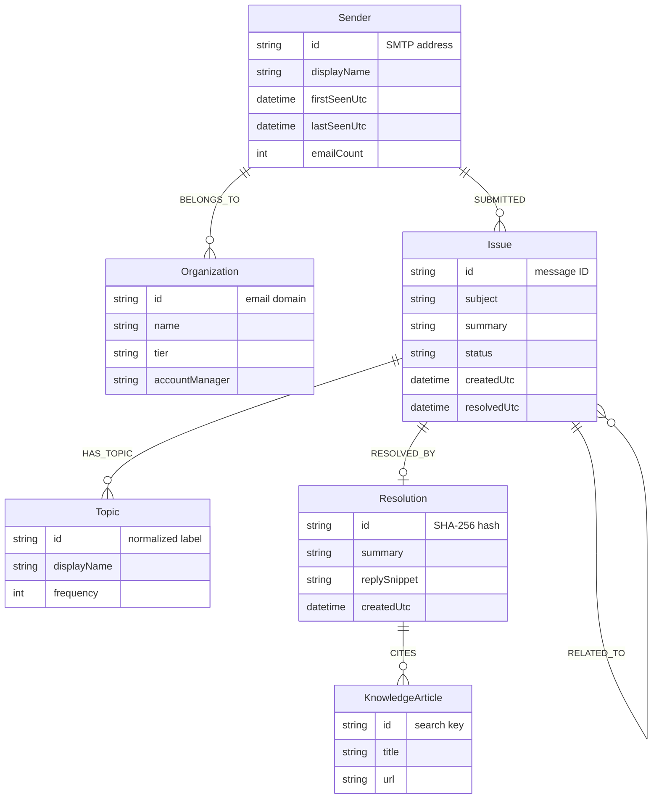
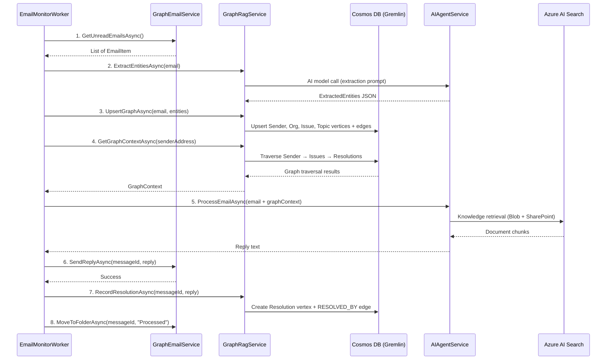

# Graph RAG with Azure Cosmos DB for Apache Gremlin

This document describes the **optional, advanced GraphRAG** capability of the **emailAgent**, which uses **Azure Cosmos DB for Apache Gremlin** as a knowledge graph store.  GraphRAG is **disabled by default** in the sample (`GraphRag:Enabled = false`).  When enabled, it augments AI-generated replies with structured customer relationship context.  This guide covers the architecture, data model, implementation details, and infrastructure requirements for enabling it.

---

## Table of Contents

1. [Why GraphRAG for an Email Agent?](#1-why-graphrag-for-an-email-agent)
2. [Conceptual Overview – RAG vs GraphRAG](#2-conceptual-overview--rag-vs-graphrag)
3. [High-Level Architecture](#3-high-level-architecture)
   - 3.1 [Default Architecture](#31-default-architecture)
   - 3.2 [Architecture with GraphRAG Enabled](#32-architecture-with-graphrag-enabled)
4. [Graph Data Model](#4-graph-data-model)
   - 4.1 [Vertex Types](#41-vertex-types)
   - 4.2 [Edge Types](#42-edge-types)
   - 4.3 [Entity-Relationship Diagram](#43-entity-relationship-diagram)
5. [Component Deep-Dive](#5-component-deep-dive)
   - 5.1 [Cosmos DB Gremlin Store](#51-cosmos-db-gremlin-store)
   - 5.2 [GraphRagSettings](#52-graphragsettings)
   - 5.3 [IGraphRagService / GraphRagService](#53-igraphragservice--graphragservice)
   - 5.4 [Entity Extraction (AI-Assisted)](#54-entity-extraction-ai-assisted)
   - 5.5 [Graph Context Retrieval](#55-graph-context-retrieval)
   - 5.6 [Updated AIAgentService](#56-updated-aiagentservice)
   - 5.7 [Updated EmailMonitorWorker](#57-updated-emailmonitorworker)
6. [Data Flow – Step by Step](#6-data-flow--step-by-step)
7. [Implementation Guide](#7-implementation-guide)
   - 7.1 [NuGet Packages](#71-nuget-packages)
   - 7.2 [GraphRagSettings.cs](#72-graphragsettingscs)
   - 7.3 [GraphContext.cs (Model)](#73-graphcontextcs-model)
   - 7.4 [IGraphRagService.cs](#74-igraphragservicecs)
   - 7.5 [GraphRagService.cs](#75-graphragservicecs)
   - 7.6 [Updating AIAgentService.cs](#76-updating-aiagentservicecs)
   - 7.7 [Updating EmailMonitorWorker.cs](#77-updating-emailmonitorworkercs)
   - 7.8 [Updating Program.cs](#78-updating-programcs)
   - 7.9 [Updating appsettings.json](#79-updating-appsettingsjson)
8. [Infrastructure Setup](#8-infrastructure-setup)
   - 8.1 [Create Cosmos DB for Gremlin](#81-create-cosmos-db-for-gremlin)
   - 8.2 [IAM and Managed Identity](#82-iam-and-managed-identity)
   - 8.3 [Gremlin Graph Provisioning](#83-gremlin-graph-provisioning)
9. [Gremlin Query Reference](#9-gremlin-query-reference)
10. [Performance and Cost Considerations](#10-performance-and-cost-considerations)
11. [Observability](#11-observability)
12. [Future Extensions](#12-future-extensions)

---

## 1. Why GraphRAG for an Email Agent?

Standard Retrieval-Augmented Generation (RAG) retrieves **flat, independent chunks** of text from a vector index and injects them into the LLM prompt.  This works well for factual look-ups ("What is the refund policy?") but fails to capture the **relational context** that makes email support inherently graph-shaped:

| Question a flat RAG cannot answer well | Why a graph helps |
|---|---|
| Has this customer reported the same issue before? | *Sender → SUBMITTED → Issue* traversal |
| Which issues are commonly linked to a specific product? | *Product → HAS_ISSUE → Issue* traversal |
| Who resolved a similar ticket last time, and how? | *Issue → RESOLVED_BY → Resolution* traversal |
| Is this sender from a high-priority account? | *Sender → BELONGS_TO → Organization* with priority property |
| Are there known workarounds for this category of problem? | *Topic → HAS_WORKAROUND → KnowledgeArticle* traversal |

By storing **entities and their relationships** in a graph and traversing that graph before calling the LLM, the agent can produce replies that are:

- **Personalized** – aware of the sender's history and tier.
- **Consistent** – repeat issues receive the same (or improved) resolution.
- **Contextually rich** – linked to prior resolutions, known workarounds, and related tickets.
- **Escalation-aware** – patterns that indicate a recurring or critical problem surface automatically.

---

## 2. Conceptual Overview – RAG vs GraphRAG



> Context window contains independent chunks with no relationship between them.



> Context window: sender history, related issues, past resolutions, org priority, plus relevant document chunks.

GraphRAG **does not replace** the existing Azure AI Search / SharePoint retrieval – it **augments** it with structured relational context.

---

## 3. High-Level Architecture

### 3.1 Default Architecture



### 3.2 Architecture with GraphRAG Enabled



---

## 4. Graph Data Model

The graph schema is intentionally kept small and domain-focused.  Every vertex and edge is designed to answer a specific question that improves reply quality.

### 4.1 Vertex Types

#### `Sender`
Represents a unique email correspondent identified by their SMTP address.

| Property | Type | Description |
|---|---|---|
| `id` | `string` | SMTP address (e.g. `alice@contoso.com`) – used as the stable vertex ID |
| `displayName` | `string` | Display name from the last received email |
| `firstSeenUtc` | `datetime` | When the system first saw an email from this sender |
| `lastSeenUtc` | `datetime` | When the most recent email was received |
| `emailCount` | `int` | Running total of emails processed |

**Why**: The sender is the pivot point for all relationship traversals.  Most useful queries start here.

---

#### `Organization`
Represents a company or domain linked to one or more senders.

| Property | Type | Description |
|---|---|---|
| `id` | `string` | Email domain (e.g. `contoso.com`) or a CRM account ID |
| `name` | `string` | Human-readable organization name |
| `tier` | `string` | Support tier: `"enterprise"`, `"business"`, `"community"` |
| `accountManager` | `string` | Optional: name of the account manager |

**Why**: Knowing a sender's organization and tier lets the agent adjust tone, SLA references, and escalation language.

---

#### `Topic`
Represents a subject matter or problem domain mentioned in emails.

| Property | Type | Description |
|---|---|---|
| `id` | `string` | Normalized label, e.g. `"billing"`, `"connectivity"`, `"authentication"` |
| `displayName` | `string` | Human-friendly label |
| `frequency` | `int` | How many times this topic has appeared across all emails |

**Why**: Topics act as a bridge between individual emails and the broader knowledge base.  Linking emails to topics allows the agent to detect recurring problem areas.

---

#### `Issue`
Represents a single support case derived from one or more emails.

| Property | Type | Description |
|---|---|---|
| `id` | `string` | Graph-message-ID of the originating email |
| `subject` | `string` | Email subject line |
| `summary` | `string` | AI-generated one-sentence summary |
| `status` | `string` | `"open"` or `"resolved"` |
| `createdUtc` | `datetime` | When the issue was first recorded |
| `resolvedUtc` | `datetime?` | When the issue was resolved (nullable) |

**Why**: Issues provide a case history.  Linking a new email to similar past issues means the agent can say "We resolved a similar problem for you in March – here is the same solution."

---

#### `Resolution`
Represents how an issue was resolved.

| Property | Type | Description |
|---|---|---|
| `id` | `string` | SHA-256 of the resolution text (deduplication key) |
| `summary` | `string` | Brief description of the fix or answer |
| `replySnippet` | `string` | First 500 characters of the reply that was sent |
| `createdUtc` | `datetime` | When this resolution was recorded |

**Why**: Storing resolutions separately (and deduplicating them) makes it possible to say "This fix has resolved 12 issues across 8 customers."

---

#### `KnowledgeArticle`
Represents a document from Azure Blob Storage or SharePoint that was useful in resolving an issue.

| Property | Type | Description |
|---|---|---|
| `id` | `string` | Azure AI Search document key |
| `title` | `string` | Document title |
| `url` | `string?` | SharePoint or Blob URL if available |

**Why**: Linking resolutions back to specific documents closes the feedback loop: if a document is cited frequently, it is a high-value knowledge asset.  Documents that are never cited can be deprioritized or archived.

---

### 4.2 Edge Types

#### `SUBMITTED`  ·  `Sender → Issue`
Records that a particular sender submitted (originated) an issue.

| Property | Type | Description |
|---|---|---|
| `emailId` | `string` | Graph message ID |
| `submittedUtc` | `datetime` | Timestamp |

---

#### `BELONGS_TO`  ·  `Sender → Organization`
Links a sender to their organization (derived from email domain or CRM lookup).

| Property | Type | Description |
|---|---|---|
| `inferredAt` | `datetime` | When the relationship was first inferred |
| `confidence` | `float` | `0.0`–`1.0`; `1.0` if verified via CRM |

---

#### `HAS_TOPIC`  ·  `Issue → Topic`
Links an issue to one or more topic labels.

| Property | Type | Description |
|---|---|---|
| `confidence` | `float` | AI extraction confidence score |

---

#### `RESOLVED_BY`  ·  `Issue → Resolution`
Records how an issue was resolved.

| Property | Type | Description |
|---|---|---|
| `resolvedUtc` | `datetime` | Resolution timestamp |

---

#### `CITES`  ·  `Resolution → KnowledgeArticle`
Records which knowledge articles were referenced in a resolution.

| Property | Type | Description |
|---|---|---|
| `citedAt` | `datetime` | Timestamp |

---

#### `RELATED_TO`  ·  `Issue → Issue`
Bidirectional edge linking issues with similar topics or subjects.

| Property | Type | Description |
|---|---|---|
| `similarity` | `float` | Cosine similarity of the issue summaries |

---

### 4.3 Entity-Relationship Diagram



---

## 5. Component Deep-Dive

### 5.1 Cosmos DB Gremlin Store

**What it is**: Azure Cosmos DB for Apache Gremlin is a fully managed, globally distributed graph database that exposes the Apache TinkerPop Gremlin traversal language.  You interact with it over a WebSocket connection using Gremlin queries.

**Why Cosmos DB Gremlin specifically**:

| Concern | Cosmos DB Gremlin advantage |
|---|---|
| **Managed service** | No servers to manage; SLA-backed availability |
| **Azure-native** | Same Entra ID tenant, RBAC, Private Endpoints, VNet integration |
| **Scalability** | Horizontally partitioned; handles millions of vertices |
| **Latency** | Single-digit milliseconds for point reads; graph traversals typically < 20 ms |
| **Schema flexibility** | Schema-free – new vertex/edge types and properties require no migration |
| **Multi-model** | Same account can host other Cosmos DB APIs if needed |

**Partitioning strategy**: Partition the graph by `partitionKey = "email-agent"` for development.  For production at scale, partition Sender vertices by email domain to co-locate senders from the same organization; partition Issue vertices by `senderId` to co-locate a sender's issues on the same physical partition.

---

### 5.2 GraphRagSettings

A new `Configuration/GraphRagSettings.cs` class that binds the `"GraphRag"` section of `appsettings.json`.

**Key properties**:
- `GremlinEndpoint` – the Gremlin WebSocket endpoint (format: `wss://<account>.gremlin.cosmos.azure.com:443/`)
- `DatabaseName` – the Cosmos DB database name
- `GraphName` – the Gremlin graph container name
- `PartitionKey` – the partition key value used for all vertices (simplifies the initial implementation)
- `MaxHopDepth` – how many hops to traverse when building context (default: 2; more hops = richer context but higher latency)
- `MaxRelatedIssues` – maximum number of prior issues to include in context (default: 3)

**Why separate settings**: Isolating graph settings makes it easy to disable GraphRAG by removing the section, swap the graph backend, or configure different graphs for different environments.

---

### 5.3 IGraphRagService / GraphRagService

**What it does**: `GraphRagService` is the single façade that owns all Gremlin interactions.  It is responsible for three operations:

1. **`ExtractEntitiesAsync(EmailItem)`** – calls the AI model with a structured extraction prompt to produce a typed `ExtractedEntities` object (senders, topics, organizations, issue summary).  This keeps entity extraction co-located with graph logic rather than scattered across the worker.

2. **`UpsertGraphAsync(EmailItem, ExtractedEntities)`** – idempotently merges all extracted entities into the graph.  Uses Gremlin `coalesce(g.V(id), g.addV(...))` patterns so repeated processing of the same email is safe.

3. **`GetGraphContextAsync(string senderAddress)`** – traverses the graph starting from the `Sender` vertex to collect relationship context.  Returns a `GraphContext` record that `AIAgentService` injects into the prompt.

**Why a single service**: All three operations share the same Gremlin client connection.  Grouping them avoids multiple objects holding open WebSocket connections and simplifies DI registration, lifetime management, and disposal.

**Thread safety**: The Gremlin `GremlinClient` from the `Gremlin.Net` SDK is not thread-safe across concurrent traversals.  A `SemaphoreSlim` or a pooled approach (e.g., `Microsoft.Extensions.ObjectPool`) should guard Gremlin operations.  For the email agent's single-threaded poll loop this is handled naturally.

---

### 5.4 Entity Extraction (AI-Assisted)

Entity extraction uses a **separate, low-cost model call** with a structured JSON output prompt.  Using an AI model rather than regex or a NER library provides:

- Language-agnostic extraction (the agent handles emails in any language).
- Fuzzy normalization (e.g., "auth issue", "login problem", and "can't sign in" all map to the `authentication` topic).
- Easy extension (add a new entity type by updating the extraction prompt, not the code).

**Extraction prompt structure**:

```
You are an entity extractor for a customer support system.
Given the following email, return a JSON object with these fields:

{
  "senderDomain": "contoso.com",          // domain portion of the From address
  "organizationName": "Contoso Ltd",       // inferred company name (or null)
  "topics": ["authentication", "mfa"],     // 1-3 normalized topic labels
  "issueSummary": "User cannot sign in with MFA enabled",  // ≤ 15 words
  "issueType": "authentication"            // single primary topic label
}

Respond with valid JSON only.  Do not include any other text.

Email:
---
From: Alice Smith <alice@contoso.com>
Subject: MFA login broken
Body: ...
```

**Why structured JSON output**: JSON is trivially deserializable in C# with `System.Text.Json`.  Asking for "valid JSON only" and no preamble is a well-established pattern for structured extraction with GPT models.

---

### 5.5 Graph Context Retrieval

The retrieval traversal starts at the `Sender` vertex and walks outward to collect supporting context:

```gremlin
// 1. Find the sender vertex and their organization
g.V(senderId).as('s')
  .optional(out('BELONGS_TO').as('org'))

// 2. Find up to N recent issues submitted by this sender
g.V(senderId).out('SUBMITTED')
  .order().by('createdUtc', decr)
  .limit(3).as('issue')

// 3. For each issue, get its resolutions
  .optional(out('RESOLVED_BY').as('resolution'))

// 4. Get topics for each issue
  .optional(out('HAS_TOPIC').as('topic'))
```

The result is assembled into a `GraphContext` record:

```csharp
public sealed record GraphContext(
    string? OrganizationName,
    string? SupportTier,
    int PriorEmailCount,
    IReadOnlyList<PriorIssue> PriorIssues,
    IReadOnlyList<string> KnownTopics);

public sealed record PriorIssue(
    string Subject,
    string Summary,
    string Status,
    DateTimeOffset CreatedAt,
    string? ResolutionSummary);
```

**Why limit traversal depth**: Graph traversals can explode exponentially.  A depth-2 traversal (Sender → Issue → Resolution) is sufficient to provide useful context while keeping query latency under 50 ms.

---

### 5.6 Updated AIAgentService

`AIAgentService.ProcessEmailAsync` gains an optional `GraphContext? graphContext` parameter.

When a non-null `GraphContext` is supplied, a **graph context block** is prepended to the user prompt before it is sent to the Foundry agent:

```
=== CUSTOMER RELATIONSHIP CONTEXT ===
Organization : Contoso Ltd (enterprise tier)
Account history: 7 previous emails processed

Prior issues:
  [1] Subject: "MFA login broken" (2024-11-03) – RESOLVED
      Resolution: Reset MFA device registration via admin portal.
  [2] Subject: "Password reset not working" (2024-10-15) – RESOLVED
      Resolution: Password reset email was in spam folder.

Known topics for this sender: authentication, account-management
======================================

From: Alice Smith <alice@contoso.com>
Subject: MFA login broken again
...
```

**Why inject context as a prompt prefix rather than as a separate tool**: The Foundry agent already has two retrieval tools (AI Search and SharePoint).  Adding a third "graph lookup" tool would require exposing the Gremlin endpoint as a function tool, which adds latency and complexity.  Injecting context directly into the prompt is simpler, more deterministic, and fully compatible with the existing `ProjectResponsesClient` call.

**Backwards compatibility**: The `graphContext` parameter defaults to `null`.  When it is `null`, the method behaves exactly as before.  This ensures no breaking change if GraphRAG is disabled.

---

### 5.7 Updated EmailMonitorWorker

`ProcessSingleEmailAsync` gains two new steps:

```
Before  (existing): AI agent ──► send reply ──► move to folder
After   (new):      GraphRag extract+upsert ──► GraphRag get context
                    ──► AI agent (with context) ──► send reply
                    ──► move to folder
                    ──► GraphRag record resolution
```

The worker calls `GraphRagService` before and after the AI agent:

1. **Before** the AI call: extract entities, upsert the graph, retrieve context.
2. **After** the AI call: update the `Issue` vertex status to `"resolved"` and attach a `Resolution` vertex.

**Why record resolution after the reply is sent**: Only replies that were actually sent should be considered resolutions.  Recording the resolution before sending risks persisting a resolution for a reply that failed to deliver.

---

## 6. Data Flow – Step by Step



---

## 7. Implementation Guide

### 7.1 NuGet Packages

Add the following package to `src/EmailAgent/EmailAgent.csproj`:

```xml
<PackageReference Include="Gremlin.Net" Version="3.7.3" />
```

`Gremlin.Net` is the official Apache TinkerPop .NET driver.  Version 3.7.x is the latest stable release that targets .NET Standard 2.0 (compatible with .NET 10).

> **Security note**: Always check the [GitHub Advisory Database](https://github.com/advisories) for any known vulnerabilities before pinning a version.

---

### 7.2 GraphRagSettings.cs

Create `src/EmailAgent/Configuration/GraphRagSettings.cs`:

```csharp
namespace EmailAgent.Configuration;

/// <summary>
/// Configuration for the GraphRAG feature backed by Azure Cosmos DB for Apache Gremlin.
/// Bind from appsettings.json under the "GraphRag" key.
/// </summary>
public sealed class GraphRagSettings
{
    /// <summary>
    /// Gremlin WebSocket endpoint.
    /// Format: wss://&lt;account&gt;.gremlin.cosmos.azure.com:443/
    /// </summary>
    public string GremlinEndpoint { get; set; } = string.Empty;

    /// <summary>
    /// Cosmos DB database name that contains the Gremlin graph.
    /// </summary>
    public string DatabaseName { get; set; } = string.Empty;

    /// <summary>
    /// Name of the Gremlin graph container within the database.
    /// </summary>
    public string GraphName { get; set; } = string.Empty;

    /// <summary>
    /// Cosmos DB account key (primary or secondary).
    /// Use Azure Key Vault or user secrets; never commit to source control.
    /// </summary>
    public string AccountKey { get; set; } = string.Empty;

    /// <summary>
    /// Partition key value used for all vertices in a single-partition setup.
    /// Switch to per-entity partitioning for large-scale deployments.
    /// </summary>
    public string PartitionKey { get; set; } = "email-agent";

    /// <summary>
    /// Maximum number of prior issues to include in the graph context.
    /// Higher values provide richer context but increase prompt token usage.
    /// Default: 3.
    /// </summary>
    public int MaxRelatedIssues { get; set; } = 3;

    /// <summary>
    /// When true, GraphRAG entity extraction and graph operations are skipped.
    /// Allows graceful degradation if the Cosmos DB endpoint is unavailable.
    /// </summary>
    public bool Enabled { get; set; } = true;
}
```

---

### 7.3 GraphContext.cs (Model)

Create `src/EmailAgent/Models/GraphContext.cs`:

```csharp
namespace EmailAgent.Models;

/// <summary>
/// Structured context retrieved from the knowledge graph for a given sender.
/// Injected into the AI agent prompt to provide relational history and
/// organizational context that vector search alone cannot supply.
/// </summary>
public sealed record GraphContext(
    /// <summary>
    /// Name of the organization the sender belongs to, if known.
    /// </summary>
    string? OrganizationName,

    /// <summary>
    /// Support tier of the organization: "enterprise", "business", or "community".
    /// Null if unknown.
    /// </summary>
    string? SupportTier,

    /// <summary>
    /// Total number of emails processed for this sender to date.
    /// </summary>
    int PriorEmailCount,

    /// <summary>
    /// The N most recent issues submitted by this sender (ordered newest-first).
    /// </summary>
    IReadOnlyList<PriorIssue> PriorIssues,

    /// <summary>
    /// Normalized topic labels associated with this sender's past issues.
    /// </summary>
    IReadOnlyList<string> KnownTopics);

/// <summary>
/// A summary of a single past issue and its resolution (if available).
/// </summary>
public sealed record PriorIssue(
    string Subject,
    string Summary,
    string Status,
    DateTimeOffset CreatedAt,
    string? ResolutionSummary);
```

---

### 7.4 IGraphRagService.cs

Create `src/EmailAgent/Services/IGraphRagService.cs`:

```csharp
using EmailAgent.Models;

namespace EmailAgent.Services;

/// <summary>
/// Abstraction over the GraphRAG pipeline:
/// entity extraction, graph persistence, and context retrieval.
/// </summary>
public interface IGraphRagService
{
    /// <summary>
    /// Extracts named entities (topics, organization, issue summary) from the
    /// given email using the configured AI model.
    /// </summary>
    Task<ExtractedEntities> ExtractEntitiesAsync(
        EmailItem email,
        CancellationToken cancellationToken = default);

    /// <summary>
    /// Idempotently upserts the email's entities and relationships into the
    /// Cosmos DB Gremlin graph.
    /// </summary>
    Task UpsertGraphAsync(
        EmailItem email,
        ExtractedEntities entities,
        CancellationToken cancellationToken = default);

    /// <summary>
    /// Traverses the graph from the sender's vertex to collect prior issues,
    /// resolutions, and organizational context.
    /// </summary>
    Task<GraphContext> GetGraphContextAsync(
        string senderAddress,
        CancellationToken cancellationToken = default);

    /// <summary>
    /// Records the AI-generated reply as a resolution attached to the issue
    /// vertex in the graph.  Call this after the reply has been sent
    /// successfully so that only delivered replies are persisted.
    /// </summary>
    Task RecordResolutionAsync(
        string messageId,
        string replyBody,
        CancellationToken cancellationToken = default);
}

/// <summary>
/// Structured entities extracted from an email by the AI model.
/// </summary>
public sealed record ExtractedEntities(
    string SenderDomain,
    string? OrganizationName,
    IReadOnlyList<string> Topics,
    string IssueSummary,
    string PrimaryTopic);
```

---

### 7.5 GraphRagService.cs

Create `src/EmailAgent/Services/GraphRagService.cs`.  Below is the full implementation with detailed inline documentation:

```csharp
using System.Security.Cryptography;
using System.Text;
using System.Text.Json;
using Azure.AI.Projects;
using Azure.Identity;
using EmailAgent.Configuration;
using EmailAgent.Models;
using Gremlin.Net.Driver;
using Gremlin.Net.Driver.Remote;
using Gremlin.Net.Process.Traversal;
using Microsoft.Extensions.Options;
using static Gremlin.Net.Process.Traversal.AnonymousTraversalSource;

namespace EmailAgent.Services;

/// <summary>
/// Implements <see cref="IGraphRagService"/> using:
///   • Azure AI Foundry (same project client as AIAgentService) for entity extraction.
///   • Azure Cosmos DB for Apache Gremlin for graph storage and traversal.
///
/// Lifetime: Singleton – holds an open Gremlin WebSocket connection for the
/// lifetime of the application and reuses the AIProjectClient.
/// </summary>
public sealed class GraphRagService : IGraphRagService, IAsyncDisposable
{
    private readonly GraphRagSettings _settings;
    private readonly AIFoundrySettings _foundrySettings;
    private readonly ILogger<GraphRagService> _logger;

    // Lazily-initialized Gremlin driver connection pool.
    private GremlinClient? _gremlinClient;
    private GraphTraversalSource? _g;
    private readonly SemaphoreSlim _initLock = new(1, 1);

    // Entity extraction prompt – returns JSON so it can be parsed without
    // relying on the agent framework's structured output mode.
    private const string ExtractionSystemPrompt =
        """
        You are an entity extractor for a customer support email system.
        Given an email, return a single JSON object with exactly these fields:

        {
          "senderDomain": "<domain part of the From address>",
          "organizationName": "<inferred company name, or null>",
          "topics": ["<normalized topic 1>", "<normalized topic 2>"],
          "issueSummary": "<one sentence, ≤15 words>",
          "primaryTopic": "<single most important topic>"
        }

        Normalize topics to lowercase kebab-case (e.g. "mfa-authentication", "billing-inquiry").
        Return valid JSON only.  Do not include any other text.
        """;

    public GraphRagService(
        IOptions<GraphRagSettings> settings,
        IOptions<AIFoundrySettings> foundrySettings,
        ILogger<GraphRagService> logger)
    {
        _settings = settings.Value;
        _foundrySettings = foundrySettings.Value;
        _logger = logger;
    }

    // -----------------------------------------------------------------------
    // IGraphRagService
    // -----------------------------------------------------------------------

    /// <inheritdoc/>
    public async Task<ExtractedEntities> ExtractEntitiesAsync(
        EmailItem email,
        CancellationToken cancellationToken = default)
    {
        // Build a concise version of the email for the extraction call.
        // We intentionally omit the full body to keep token usage low.
        string emailSnippet =
            $"From: {email.SenderName} <{email.SenderAddress}>\n" +
            $"Subject: {email.Subject}\n" +
            $"Body (first 500 chars): {email.BodyText[..Math.Min(500, email.BodyText.Length)]}";

        // Use the Azure OpenAI client attached to the Foundry project for the
        // extraction call. A lightweight gpt-4o-mini deployment is ideal here.
        var projectClient = new AIProjectClient(
            new Uri(_foundrySettings.ProjectEndpoint),
            new DefaultAzureCredential());

        // Use the chat completions API directly for the extraction call as it
        // does not need the full agent framework overhead.
        var openAiClient = projectClient.ProjectOpenAIClient.GetOpenAIClientForModel(
            _foundrySettings.ModelDeploymentName);

        var messages = new List<OpenAI.Chat.ChatMessage>
        {
            OpenAI.Chat.ChatMessage.CreateSystemMessage(ExtractionSystemPrompt),
            OpenAI.Chat.ChatMessage.CreateUserMessage(emailSnippet),
        };

        var completion = await openAiClient.GetChatClient(_foundrySettings.ModelDeploymentName)
            .CompleteChatAsync(messages, cancellationToken: cancellationToken)
            .ConfigureAwait(false);

        string json = completion.Value.Content[0].Text.Trim();

        // Strip markdown code fences if the model wraps the JSON.
        if (json.StartsWith("```", StringComparison.Ordinal))
        {
            json = json.Trim('`');
            if (json.StartsWith("json", StringComparison.OrdinalIgnoreCase))
                json = json[4..].TrimStart();
        }

        using var doc = JsonDocument.Parse(json);
        var root = doc.RootElement;

        var topics = root.TryGetProperty("topics", out var topicsEl)
            ? topicsEl.EnumerateArray()
                      .Select(t => t.GetString() ?? string.Empty)
                      .Where(t => t.Length > 0)
                      .ToArray()
            : Array.Empty<string>();

        return new ExtractedEntities(
            SenderDomain: root.GetProperty("senderDomain").GetString()
                          ?? email.SenderAddress.Split('@').LastOrDefault() ?? string.Empty,
            OrganizationName: root.TryGetProperty("organizationName", out var orgEl)
                              ? orgEl.ValueKind == JsonValueKind.Null ? null : orgEl.GetString()
                              : null,
            Topics: topics,
            IssueSummary: root.GetProperty("issueSummary").GetString() ?? email.Subject,
            PrimaryTopic: root.GetProperty("primaryTopic").GetString() ?? "general");
    }

    /// <inheritdoc/>
    public async Task UpsertGraphAsync(
        EmailItem email,
        ExtractedEntities entities,
        CancellationToken cancellationToken = default)
    {
        var g = await GetTraversalSourceAsync(cancellationToken).ConfigureAwait(false);

        // ── Sender vertex ────────────────────────────────────────────────────
        // coalesce(V(id), addV()) is the idiomatic Gremlin upsert pattern.
        await g.V(email.SenderAddress)
            .Fold()
            .Coalesce<object>(
                Unfold<object>(),
                AddV("Sender")
                    .Property(T.Id, email.SenderAddress)
                    .Property("displayName", email.SenderName)
                    .Property("firstSeenUtc", email.ReceivedAt.ToString("O"))
                    .Property("partitionKey", _settings.PartitionKey))
            .Property("displayName", email.SenderName)
            .Property("lastSeenUtc", email.ReceivedAt.ToString("O"))
            .Property("emailCount",
                __.V(email.SenderAddress).Values<int>("emailCount").Next() + 1)
            .Promise(t => t.NextAsync())
            .ConfigureAwait(false);

        // ── Organization vertex + BELONGS_TO edge ───────────────────────────
        if (!string.IsNullOrWhiteSpace(entities.SenderDomain))
        {
            string orgId = entities.SenderDomain;
            string orgName = entities.OrganizationName ?? entities.SenderDomain;

            await g.V(orgId)
                .Fold()
                .Coalesce<object>(
                    Unfold<object>(),
                    AddV("Organization")
                        .Property(T.Id, orgId)
                        .Property("name", orgName)
                        .Property("tier", "community")   // default; update via CRM sync
                        .Property("partitionKey", _settings.PartitionKey))
                .Promise(t => t.NextAsync())
                .ConfigureAwait(false);

            // Add BELONGS_TO edge if it does not already exist.
            bool edgeExists = await g.V(email.SenderAddress)
                .OutE("BELONGS_TO").InV().HasId(orgId)
                .Promise(t => t.HasNextAsync())
                .ConfigureAwait(false);

            if (!edgeExists)
            {
                await g.V(email.SenderAddress)
                    .AddE("BELONGS_TO")
                    .Property("inferredAt", DateTimeOffset.UtcNow.ToString("O"))
                    .Property("confidence", 0.8d)
                    .To(__.V(orgId))
                    .Promise(t => t.NextAsync())
                    .ConfigureAwait(false);
            }
        }

        // ── Issue vertex + SUBMITTED edge ────────────────────────────────────
        await g.V(email.Id)
            .Fold()
            .Coalesce<object>(
                Unfold<object>(),
                AddV("Issue")
                    .Property(T.Id, email.Id)
                    .Property("subject", email.Subject)
                    .Property("summary", entities.IssueSummary)
                    .Property("status", "open")
                    .Property("createdUtc", email.ReceivedAt.ToString("O"))
                    .Property("partitionKey", _settings.PartitionKey))
            .Promise(t => t.NextAsync())
            .ConfigureAwait(false);

        bool submittedExists = await g.V(email.SenderAddress)
            .OutE("SUBMITTED").InV().HasId(email.Id)
            .Promise(t => t.HasNextAsync())
            .ConfigureAwait(false);

        if (!submittedExists)
        {
            await g.V(email.SenderAddress)
                .AddE("SUBMITTED")
                .Property("emailId", email.Id)
                .Property("submittedUtc", email.ReceivedAt.ToString("O"))
                .To(__.V(email.Id))
                .Promise(t => t.NextAsync())
                .ConfigureAwait(false);
        }

        // ── Topic vertices + HAS_TOPIC edges ─────────────────────────────────
        foreach (string topic in entities.Topics)
        {
            await g.V(topic)
                .Fold()
                .Coalesce<object>(
                    Unfold<object>(),
                    AddV("Topic")
                        .Property(T.Id, topic)
                        .Property("displayName", topic)
                        .Property("frequency", 0)
                        .Property("partitionKey", _settings.PartitionKey))
                .Property("frequency",
                    __.V(topic).Values<int>("frequency").Next() + 1)
                .Promise(t => t.NextAsync())
                .ConfigureAwait(false);

            bool topicEdgeExists = await g.V(email.Id)
                .OutE("HAS_TOPIC").InV().HasId(topic)
                .Promise(t => t.HasNextAsync())
                .ConfigureAwait(false);

            if (!topicEdgeExists)
            {
                await g.V(email.Id)
                    .AddE("HAS_TOPIC")
                    .Property("confidence", 1.0d)
                    .To(__.V(topic))
                    .Promise(t => t.NextAsync())
                    .ConfigureAwait(false);
            }
        }

        _logger.LogInformation(
            "Graph updated for sender '{Sender}' / issue '{MessageId}'.",
            email.SenderAddress, email.Id);
    }

    /// <inheritdoc/>
    public async Task<GraphContext> GetGraphContextAsync(
        string senderAddress,
        CancellationToken cancellationToken = default)
    {
        var g = await GetTraversalSourceAsync(cancellationToken).ConfigureAwait(false);

        // ── Organization context ─────────────────────────────────────────────
        string? orgName = null;
        string? tier = null;

        var orgVertices = await g.V(senderAddress)
            .Out("BELONGS_TO")
            .ValueMap<object>("name", "tier")
            .Promise(t => t.ToListAsync())
            .ConfigureAwait(false);

        if (orgVertices.Count > 0)
        {
            var orgProps = orgVertices[0];
            orgName = GetProp(orgProps, "name");
            tier = GetProp(orgProps, "tier");
        }

        // ── Sender email count ───────────────────────────────────────────────
        int emailCount = 0;
        var countResult = await g.V(senderAddress)
            .Values<int>("emailCount")
            .Promise(t => t.ToListAsync())
            .ConfigureAwait(false);
        if (countResult.Count > 0) emailCount = countResult[0];

        // ── Prior issues + resolutions ───────────────────────────────────────
        var priorIssues = new List<PriorIssue>();

        var issueMaps = await g.V(senderAddress)
            .Out("SUBMITTED")
            .Order().By("createdUtc", Order.Desc)
            .Limit<object>(_settings.MaxRelatedIssues)
            .Project<object>("subject", "summary", "status", "createdUtc", "resolution")
                .By("subject")
                .By("summary")
                .By("status")
                .By("createdUtc")
                .By(__.Out("RESOLVED_BY").Values<string>("summary").Fold())
            .Promise(t => t.ToListAsync())
            .ConfigureAwait(false);

        foreach (var map in issueMaps)
        {
            if (map is not IDictionary<object, object> dict) continue;

            priorIssues.Add(new PriorIssue(
                Subject: dict.TryGetValue("subject", out var subj) ? subj?.ToString() ?? "" : "",
                Summary: dict.TryGetValue("summary", out var summ) ? summ?.ToString() ?? "" : "",
                Status: dict.TryGetValue("status", out var stat) ? stat?.ToString() ?? "" : "",
                CreatedAt: dict.TryGetValue("createdUtc", out var ts) &&
                           DateTimeOffset.TryParse(ts?.ToString(), out var dto) ? dto : DateTimeOffset.MinValue,
                ResolutionSummary: dict.TryGetValue("resolution", out var res) &&
                                   res is IList<object> resList && resList.Count > 0
                                   ? resList[0]?.ToString() : null));
        }

        // ── Known topics ─────────────────────────────────────────────────────
        var topicList = await g.V(senderAddress)
            .Out("SUBMITTED").Out("HAS_TOPIC")
            .Dedup()
            .Values<string>("displayName")
            .Promise(t => t.ToListAsync())
            .ConfigureAwait(false);

        _logger.LogDebug(
            "Graph context retrieved for '{Sender}': {IssueCount} prior issue(s), org='{Org}'.",
            senderAddress, priorIssues.Count, orgName ?? "unknown");

        return new GraphContext(
            OrganizationName: orgName,
            SupportTier: tier,
            PriorEmailCount: emailCount,
            PriorIssues: priorIssues,
            KnownTopics: topicList);
    }

    /// <inheritdoc/>
    public async Task RecordResolutionAsync(
        string messageId,
        string replyBody,
        CancellationToken cancellationToken = default)
    {
        var g = await GetTraversalSourceAsync(cancellationToken).ConfigureAwait(false);

        // Deduplicate resolutions by hashing the first 500 chars of the reply.
        string snippet = replyBody[..Math.Min(500, replyBody.Length)];
        string resolutionId = Convert.ToHexString(
            SHA256.HashData(Encoding.UTF8.GetBytes(snippet)));

        string summary = snippet.Length > 100 ? snippet[..100] + "…" : snippet;

        await g.V(resolutionId)
            .Fold()
            .Coalesce<object>(
                Unfold<object>(),
                AddV("Resolution")
                    .Property(T.Id, resolutionId)
                    .Property("summary", summary)
                    .Property("replySnippet", snippet)
                    .Property("createdUtc", DateTimeOffset.UtcNow.ToString("O"))
                    .Property("partitionKey", _settings.PartitionKey))
            .Promise(t => t.NextAsync())
            .ConfigureAwait(false);

        // Attach resolution to the issue if the edge does not already exist.
        bool edgeExists = await g.V(messageId)
            .OutE("RESOLVED_BY").InV().HasId(resolutionId)
            .Promise(t => t.HasNextAsync())
            .ConfigureAwait(false);

        if (!edgeExists)
        {
            await g.V(messageId)
                .AddE("RESOLVED_BY")
                .Property("resolvedUtc", DateTimeOffset.UtcNow.ToString("O"))
                .To(__.V(resolutionId))
                .Promise(t => t.NextAsync())
                .ConfigureAwait(false);
        }

        // Mark the issue as resolved.
        await g.V(messageId)
            .Property("status", "resolved")
            .Property("resolvedUtc", DateTimeOffset.UtcNow.ToString("O"))
            .Promise(t => t.NextAsync())
            .ConfigureAwait(false);

        _logger.LogInformation(
            "Recorded resolution for issue '{MessageId}'.", messageId);
    }

    // -----------------------------------------------------------------------
    // IAsyncDisposable
    // -----------------------------------------------------------------------

    public async ValueTask DisposeAsync()
    {
        if (_gremlinClient is not null)
        {
            await _gremlinClient.DisposeAsync().ConfigureAwait(false);
            _gremlinClient = null;
        }
    }

    // -----------------------------------------------------------------------
    // Private helpers
    // -----------------------------------------------------------------------

    private async Task<GraphTraversalSource> GetTraversalSourceAsync(
        CancellationToken cancellationToken)
    {
        if (_g is not null)
            return _g;

        await _initLock.WaitAsync(cancellationToken).ConfigureAwait(false);
        try
        {
            if (_g is not null)
                return _g;

            var uri = new Uri(_settings.GremlinEndpoint);

            var server = new GremlinServer(
                hostname: uri.Host,
                port: uri.Port,
                enableSsl: true,
                username: $"/dbs/{_settings.DatabaseName}/colls/{_settings.GraphName}",
                password: _settings.AccountKey);

            _gremlinClient = new GremlinClient(
                server,
                messageSerializer: new Gremlin.Net.Structure.IO.GraphSON.GraphSON2MessageSerializer());

            _g = Traversal().WithRemote(new DriverRemoteConnection(_gremlinClient));

            _logger.LogInformation(
                "Gremlin client connected to '{Endpoint}' (db: {Db}, graph: {Graph}).",
                uri.Host, _settings.DatabaseName, _settings.GraphName);

            return _g;
        }
        finally
        {
            _initLock.Release();
        }
    }

    private static string? GetProp(IDictionary<object, object> map, string key)
    {
        if (!map.TryGetValue(key, out var val)) return null;
        if (val is IList<object> list && list.Count > 0) return list[0]?.ToString();
        return val?.ToString();
    }
}
```

---

### 7.6 Updating AIAgentService.cs

Modify `ProcessEmailAsync` to accept an optional `GraphContext` and inject it into the prompt:

```csharp
// Add graphContext parameter (nullable for backwards compatibility)
public async Task<string> ProcessEmailAsync(
    string subject,
    string bodyText,
    string senderName,
    string senderAddress,
    GraphContext? graphContext = null,
    CancellationToken cancellationToken = default)
{
    await EnsureInitializedAsync(cancellationToken).ConfigureAwait(false);

    // Build an optional graph context block to prepend to the prompt.
    string graphContextBlock = BuildGraphContextBlock(graphContext);

    string prompt =
        $"""
        {graphContextBlock}
        From: {senderName} <{senderAddress}>
        Subject: {subject}

        {bodyText}
        """;

    // ... rest of the method unchanged
}

private static string BuildGraphContextBlock(GraphContext? ctx)
{
    if (ctx is null) return string.Empty;

    var sb = new System.Text.StringBuilder();
    sb.AppendLine("=== CUSTOMER RELATIONSHIP CONTEXT ===");

    if (ctx.OrganizationName is not null)
        sb.AppendLine($"Organization : {ctx.OrganizationName}" +
                      (ctx.SupportTier is not null ? $" ({ctx.SupportTier} tier)" : ""));

    if (ctx.PriorEmailCount > 0)
        sb.AppendLine($"Account history: {ctx.PriorEmailCount} previous email(s) processed");

    if (ctx.PriorIssues.Count > 0)
    {
        sb.AppendLine("Prior issues (newest first):");
        int i = 1;
        foreach (var issue in ctx.PriorIssues)
        {
            sb.AppendLine(
                $"  [{i++}] \"{issue.Subject}\" ({issue.CreatedAt:yyyy-MM-dd}) – {issue.Status.ToUpperInvariant()}");
            if (issue.ResolutionSummary is not null)
                sb.AppendLine($"       Resolution: {issue.ResolutionSummary}");
        }
    }

    if (ctx.KnownTopics.Count > 0)
        sb.AppendLine($"Known topics for this sender: {string.Join(", ", ctx.KnownTopics)}");

    sb.AppendLine("======================================");
    sb.AppendLine();
    return sb.ToString();
}
```

Also update `IAIAgentService.cs`:

```csharp
Task<string> ProcessEmailAsync(
    string subject,
    string bodyText,
    string senderName,
    string senderAddress,
    GraphContext? graphContext = null,
    CancellationToken cancellationToken = default);
```

---

### 7.7 Updating EmailMonitorWorker.cs

```csharp
private async Task ProcessSingleEmailAsync(
    EmailItem email,
    CancellationToken cancellationToken)
{
    _logger.LogInformation(
        "Processing email from '{Sender}' – subject: '{Subject}'.",
        email.SenderAddress, email.Subject);

    try
    {
        GraphContext? graphContext = null;

        if (_graphRagSettings.Enabled)
        {
            // Step A – Extract entities and upsert the graph.
            var entities = await _graphRagService
                .ExtractEntitiesAsync(email, cancellationToken)
                .ConfigureAwait(false);

            await _graphRagService
                .UpsertGraphAsync(email, entities, cancellationToken)
                .ConfigureAwait(false);

            // Step B – Retrieve relationship context for the prompt.
            graphContext = await _graphRagService
                .GetGraphContextAsync(email.SenderAddress, cancellationToken)
                .ConfigureAwait(false);
        }

        // Step C – Generate a reply with graph-enriched context.
        string replyBody = await _aiAgentService.ProcessEmailAsync(
            email.Subject,
            email.BodyText,
            email.SenderName,
            email.SenderAddress,
            graphContext,
            cancellationToken)
            .ConfigureAwait(false);

        if (string.IsNullOrWhiteSpace(replyBody))
        {
            _logger.LogWarning(
                "AI agent returned an empty reply for email {MessageId}. Skipping reply and move.",
                email.Id);
            return;
        }

        // Step D – Send the reply.
        await _graphEmailService.SendReplyAsync(email.Id, replyBody, cancellationToken)
            .ConfigureAwait(false);

        // Step E – Record the resolution in the graph (only after successful send).
        if (_graphRagSettings.Enabled)
        {
            await _graphRagService
                .RecordResolutionAsync(email.Id, replyBody, cancellationToken)
                .ConfigureAwait(false);
        }

        // Step F – Move to processed folder.
        await _graphEmailService.MoveToFolderAsync(
            email.Id,
            _settings.ProcessedFolderName,
            cancellationToken)
            .ConfigureAwait(false);

        _logger.LogInformation(
            "Successfully processed email {MessageId} from '{Sender}'.",
            email.Id, email.SenderAddress);
    }
    catch (Exception ex) when (ex is not OperationCanceledException)
    {
        _logger.LogError(ex,
            "Failed to process email {MessageId} from '{Sender}'. " +
            "The message will be retried on the next poll cycle.",
            email.Id, email.SenderAddress);
    }
}
```

---

### 7.8 Updating Program.cs

```csharp
// Add to the configuration section:
builder.Services.Configure<GraphRagSettings>(
    builder.Configuration.GetSection("GraphRag"));

// Add to the services section:
builder.Services.AddSingleton<IGraphRagService, GraphRagService>();
```

---

### 7.9 Updating appsettings.json

```json
"GraphRag": {
  "GremlinEndpoint": "wss://<account>.gremlin.cosmos.azure.com:443/",
  "DatabaseName": "emailAgentDb",
  "GraphName": "knowledgeGraph",
  "AccountKey": "",
  "PartitionKey": "email-agent",
  "MaxRelatedIssues": 3,
  "Enabled": true
}
```

> **Security**: Set `AccountKey` via user secrets or environment variables.  Never commit the account key to source control.
>
> ```bash
> dotnet user-secrets set "GraphRag:AccountKey" "<your-account-key>"
> ```

---

## 8. Infrastructure Setup

### 8.1 Create Cosmos DB for Gremlin

**Azure Portal**:

1. Search for **"Azure Cosmos DB"** → **Create** → Select **"Azure Cosmos DB for Apache Gremlin"**.
2. Choose your subscription, resource group, and a globally unique account name.
3. Select **Serverless** capacity mode for development (no minimum RU/s charge).  Switch to **Provisioned throughput** for production.
4. Leave **Geo-redundancy** and **Multi-region writes** disabled for development.
5. Under the **Networking** tab, add your Azure Container App / AKS outbound IP range to the firewall.

**Azure CLI**:

```bash
# Create a Gremlin account
az cosmosdb create \
  --resource-group rg-emailagent \
  --name cosdb-emailagent \
  --capabilities EnableGremlin \
  --default-consistency-level Session \
  --locations regionName=eastus failoverPriority=0 isZoneRedundant=false

# Create the database
az cosmosdb gremlin database create \
  --resource-group rg-emailagent \
  --account-name cosdb-emailagent \
  --name emailAgentDb

# Create the graph with a partition key
az cosmosdb gremlin graph create \
  --resource-group rg-emailagent \
  --account-name cosdb-emailagent \
  --database-name emailAgentDb \
  --name knowledgeGraph \
  --partition-key-path /partitionKey \
  --throughput 400
```

---

### 8.2 IAM and Managed Identity

For production deployments, avoid using account keys.  Instead, assign the managed identity the **Cosmos DB Built-in Data Contributor** role:

```bash
# Get the managed identity principal ID
PRINCIPAL_ID=$(az identity show \
  --resource-group rg-emailagent \
  --name id-emailagent \
  --query principalId -o tsv)

# Assign Cosmos DB Built-in Data Contributor
az cosmosdb sql role assignment create \
  --resource-group rg-emailagent \
  --account-name cosdb-emailagent \
  --role-definition-name "Cosmos DB Built-in Data Contributor" \
  --principal-id $PRINCIPAL_ID \
  --scope "/"
```

> **Note**: Gremlin API does not support token-based auth (`DefaultAzureCredential`) at the time of writing (April 2025).  Account key or resource token auth are the supported methods.  Follow the [Azure Cosmos DB for Apache Gremlin security roadmap](https://feedback.azure.com/forums/263030-azure-cosmos-db) for managed identity support updates.  Store the account key in **Azure Key Vault** and reference it as a Key Vault secret in your Container App / AKS configuration.

---

### 8.3 Gremlin Graph Provisioning

The graph schema is created implicitly by the upsert operations in `GraphRagService`.  However, you may want to create **composite indexes** for frequently-traversed paths:

```gremlin
// In Azure Data Studio or the Azure Portal Data Explorer:

// Index on Sender.lastSeenUtc for sorting
g.V().hasLabel('Sender').has('lastSeenUtc')  // Verify property exists after first ingest

// Add a composite index for Issue ordering
// (Gremlin on Cosmos DB uses automatic indexing by default on all properties)
```

Cosmos DB Gremlin indexes all vertex and edge properties automatically by default.  No explicit index creation is required for correctness; explicit composite indexes are only needed for performance tuning beyond the 10 GB/partition limit.

---

## 9. Gremlin Query Reference

These queries are useful for operational debugging and analytics in the Azure Portal Data Explorer or Azure Data Studio.

```gremlin
// All senders and their email counts
g.V().hasLabel('Sender').valueMap('displayName','emailCount').limit(20)

// Top 10 most common topics
g.V().hasLabel('Topic').order().by('frequency', decr).limit(10).valueMap('id','frequency')

// All issues for a specific sender
g.V('alice@contoso.com').out('SUBMITTED').valueMap('subject','status','createdUtc')

// Sender history with resolutions
g.V('alice@contoso.com')
  .out('SUBMITTED')
  .project('subject','resolution')
    .by('subject')
    .by(out('RESOLVED_BY').values('summary').fold())

// Find all senders who have reported 'authentication' issues
g.V('authentication').in('HAS_TOPIC').in('SUBMITTED').dedup().values('id')

// Resolution reuse – find resolutions used more than once
g.V().hasLabel('Resolution')
  .where(in('RESOLVED_BY').count().is(gt(1)))
  .valueMap('summary')

// Drop all data (use with caution – for development reset only)
g.V().drop()
```

---

## 10. Performance and Cost Considerations

### Token Usage

| Operation | Approx. input tokens | Model recommendation |
|---|---|---|
| Entity extraction | ~300–600 | `gpt-4o-mini` (cheap) |
| Email reply generation | ~2,000–8,000 | `gpt-4o` (existing) |
| Graph context block | ~200–600 added to reply prompt | — |

Using `gpt-4o-mini` for entity extraction costs roughly 1/15th of `gpt-4o`.  Consider adding a separate `ExtractionModelDeploymentName` setting to `AIFoundrySettings` so the two model calls can use different deployments.

### Gremlin Latency

| Operation | Typical latency |
|---|---|
| Single vertex upsert | 5–15 ms |
| Edge creation | 5–15 ms |
| 2-hop traversal (sender → issues → resolutions) | 20–50 ms |
| Full `UpsertGraphAsync` (6–8 ops) | 60–150 ms |

The added latency per email is approximately **100–200 ms** in the happy path.  Given that the poll cycle is typically 30+ seconds and email reply generation takes several seconds, this overhead is negligible.

### Cosmos DB Throughput

For a team processing up to ~500 emails/day:
- **Serverless** mode is sufficient and cost-effective (pay per request unit consumed).
- Expected RU/s usage: ~200–400 RU per email (upserts + traversals).
- Estimated cost: < $5/month at 500 emails/day in most Azure regions.

For higher volumes (>10,000 emails/day), switch to **provisioned throughput** at 400–1,000 RU/s.

### Graceful Degradation

The `GraphRagSettings.Enabled` flag allows the feature to be disabled without code changes.  Additionally, wrap all `GraphRagService` calls in the worker with a try/catch that logs warnings and falls back to the non-graph path:

```csharp
try
{
    var entities = await _graphRagService.ExtractEntitiesAsync(email, cancellationToken);
    // ...
}
catch (Exception ex)
{
    _logger.LogWarning(ex, "GraphRAG unavailable – falling back to standard RAG.");
    graphContext = null;
}
```

This ensures that a Cosmos DB outage does not stop email processing entirely.

---

## 11. Observability

### Structured Log Events

All `GraphRagService` log messages use structured logging with consistent field names:

| Event | Level | Fields |
|---|---|---|
| Graph updated | `Information` | `Sender`, `MessageId` |
| Graph context retrieved | `Debug` | `Sender`, `IssueCount`, `Org` |
| Resolution recorded | `Information` | `MessageId` |
| Gremlin client connected | `Information` | `Endpoint`, `Db`, `Graph` |
| GraphRAG fallback | `Warning` | `Exception` |

### Metrics to Track

Add Application Insights counters or OpenTelemetry metrics for:

- `email_agent.graph.entities_extracted` (counter) – tracks extraction volume.
- `email_agent.graph.upsert_duration_ms` (histogram) – detects Gremlin latency spikes.
- `email_agent.graph.context_prior_issues` (histogram) – measures how often prior issues are found (a proxy for graph "warmth").
- `email_agent.graph.resolutions_recorded` (counter) – tracks knowledge accumulation rate.

---

## 12. Future Extensions

| Extension | Description |
|---|---|
| **Semantic edge similarity** | Add `RELATED_TO` edges between issues whose AI-generated summaries have a cosine similarity above a threshold.  This enables "find similar issues" traversals even across different senders. |
| **CRM integration** | Sync organization `tier` and `accountManager` from a CRM (Dynamics 365, Salesforce) into the `Organization` vertex on a schedule. |
| **Knowledge article feedback loop** | After a reply is sent, parse the Foundry agent's citations and create `CITES` edges from `Resolution → KnowledgeArticle`.  Use edge frequency to surface high-value documents. |
| **Escalation detection** | Add a Gremlin query to `EmailMonitorWorker` that flags senders with > N open issues or > M emails in the past 7 days, and prepends an escalation note to the AI prompt. |
| **Graph-aware search re-ranking** | Use graph centrality scores (e.g., PageRank over `HAS_TOPIC` edges) to boost Azure AI Search results that are relevant to the sender's known topics. |
| **Visualization dashboard** | Export the graph to Azure Data Explorer or use the Cosmos DB Graph Explorer for a visual map of customer–issue–resolution relationships. |
| **Managed identity auth for Gremlin** | When Azure adds Entra ID support to the Gremlin API, replace the account-key credential with `DefaultAzureCredential` for keyless authentication. |
